<h1 align="center" style="border-bottom: none;">:rocket: Watson Assistant & Jira Issues</h1>
<h3 align="center">In this hands-on tutorial you will create a demo for Watson Assistant that is able to create new Issues in your Jira project, using the Jira API and the input you provide to Watson Assistant. The language of this Watson Assistant dialog skill is german.</h3>

## Prerequisites

1. Sign up for an [IBM Cloud account](https://cloud.ibm.com/registration).
2. Fill in the required information and press the „Create Account“ button.
3. After you submit your registration, you will receive an e-mail from the IBM Cloud team with details about your account. In this e-mail, you will need to click the link provided to confirm your registration.
4. Now you should be able to login to your new IBM Cloud account ;-)
5. [Download Postman](https://www.postman.com/downloads/), a programm we will need to work with the Jira API.
6. If you haven't done so already, [sign up for Jira](https://www.atlassian.com/software/jira), you can use the free version.

## Set up your Jira Account

1. You will be required to set up your domain, for instance `my-domain-name.atlassian.net`.
2. Then you can set up projects. Create a project an make sure to find out the project ID. It can be found by going to view all projects and inspecting the element, the corresponding project ID is in the image.
 - For the first created project the ID is usually 10000
 - For the second created project the ID is usually 10001
 - ...

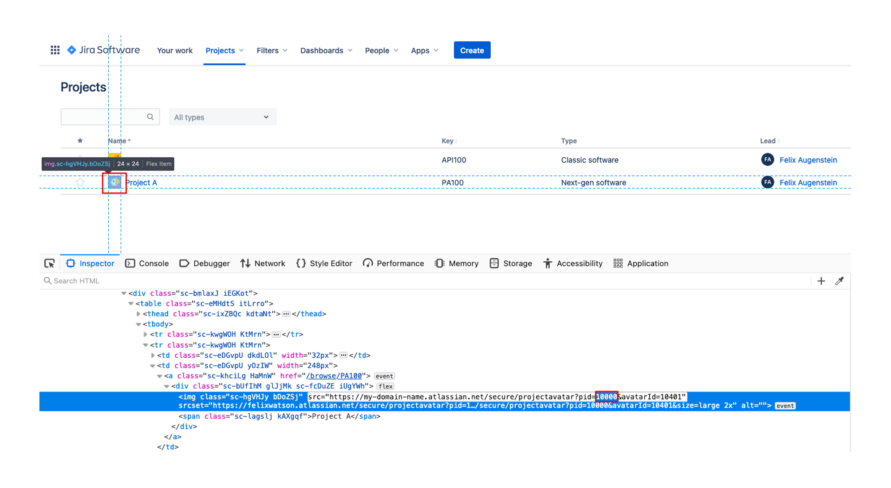

3. Finally, you need to create a new API token. Therefore, go to Account Settings --> Security --> Create and manage API tokens, then create a new API token. Choose a label, copy the generated token and save it for later.

## Verify the issuetype ID

We want to be able to create three different types of issues, which are called `Story`, `Bug`, and `Task`. In order to use them you might need to create them first.

Open your project in Jira then goto `project settings`->`Issuetypes`. If you can see the three types (on the left side), click on each of them and write down their IDs. The IDs can be found in the link of the site you are on.

The link should look something like this:

`https://YOUR_WORKSPACE.atlassian.net/jira/software/projects/YOUR_PROJECT/settings/issuetypes/10004`

In this example the issuetype ID would be 10004.

If you can't see the three Issuetypes mentioned above, you first need to create them (via the button on the left side).

## Use Postman to test the Jira API with your project

Now it is time to create our first issue via Postman and the [Jira REST API](https://developer.atlassian.com/cloud/jira/platform/rest/v3/intro/). The corresponding documentation to create an issue can be found [here](https://developer.atlassian.com/cloud/jira/platform/rest/v3/api-group-issues/#api-rest-api-3-issue-post).

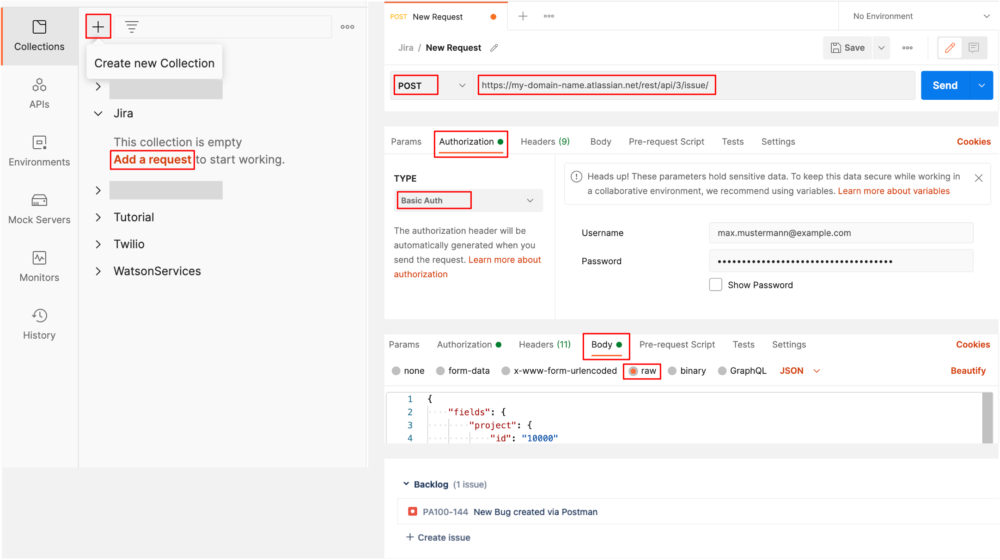

1. Create a new collection and call it for instance Jira.
2. Add a new request.
3. Select POST to make a new Post Request and provide the correct endpoint to create a new issue, with your specific domain: `https://YOUR_NAME_HERE.atlassian.net/rest/api/3/issue/`.
4. Under Authorization select Basic Auth as type and provide your email you used to register as the username and your created API token as password.
5. Then go to Body, select raw, set the content type to `JSON` and paste in the following code. Make sure to provide your correct project ID, and one of the issue IDs.  

```
{
    "fields": {
        "project": {
            "id": "YOUR_PROJECT_ID_HERE"
        },
        "issuetype": {
            "id": "YOUR_ISSUE_ID_HERE"
        },
        "summary": "New Bug created via Postman",
        "description": {
            "type": "doc",
            "version": 1,
            "content": [
                {
                "type": "paragraph",
                "content": [
                    {
                    "text": "Description of the Bug created via Postman",
                    "type": "text"
                    }
                ]
                }
            ]
        }
    }
  }
```

6. Click Send.

If you get a 201 Created response you should be able to see the new issue in your backlog inside your Jira project.

If you get a 400 Bad request response change the issuetype below the project id to some other ID (for example 10001 or 10002).


One more step: After the successful Post Request, click the code button in Postman, select native Node.Js and copy the code.

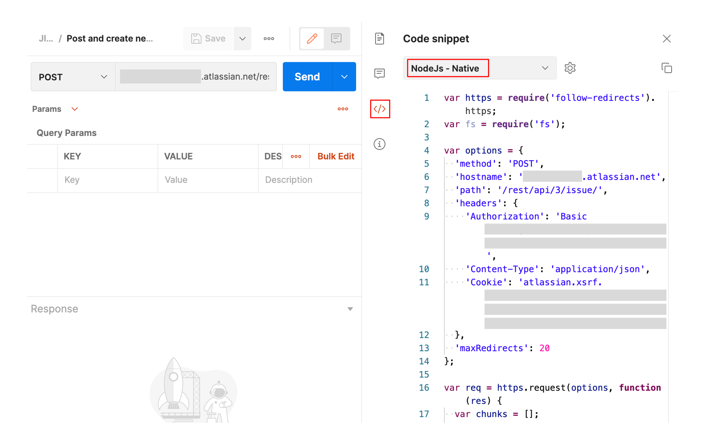

## Set up the Cloud Function

In your IBM Cloud account go to IBM Cloud Dashboard. Click the Cloud Functions button, then go to Actions and click create, to create a new action.

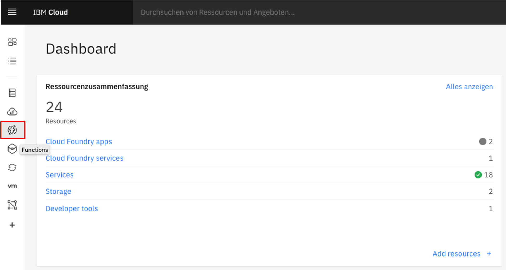

Give your action a name, keep the Default Package and choose Node.js - for instance 10 or 12 - as your runtime. Click create.

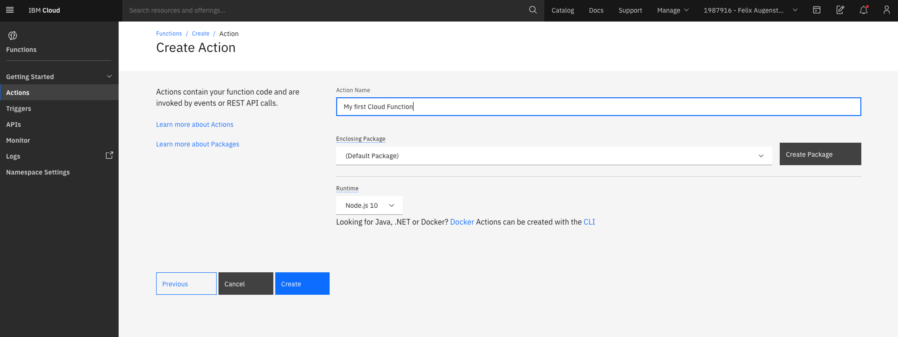

Copy and paste the `create-jira-issue.js` code (The file is included on top of this page). Now you need to provide some properties from the native Node.Js code you copied from Postman:

- Correct hostname
- Header Authorization
- Header Cookie
- Project ID

Check all the lines in the code where it says 'YOUR INPUT REQUIRED HERE' and provide those 4 properties.

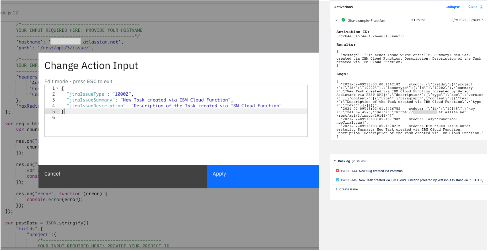

Now you can test your Cloud Function to make sure everything works fine. Therefore, save it and click Invoke with Parameters, provide the input below, paste in one of your issuetype IDs, and click Apply, then click Invoke. Results are shown in the Activations pane. In Jira your new issue should be created.

```
{
  "jiraIssueType": "YOUR_ISSUE_TYPE_ID",
  "jiraIssueSummary": "New Task created via IBM Cloud Function", 
  "jiraIssueDescription": "Description of the Task created via IBM Cloud Function"
}
```


Now go to Endpoints, enable it as a Web Action, save and copy the provided URL. You will need it later on, when setting up your Watson Assistant.

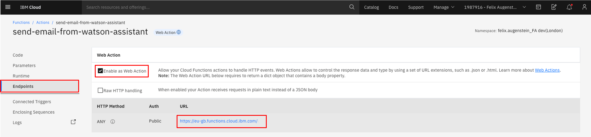

## Set up Watson Assistant on the IBM Cloud

In your IBM Cloud Account go to the dashboard by clicking the IBM Logo in the upper left. Go to Catalog and select the AI / Machine Learning category under services or search for Watson Assistant. Then create a new Watson Assistant service, the Lite Plan should work for this tutorial. 

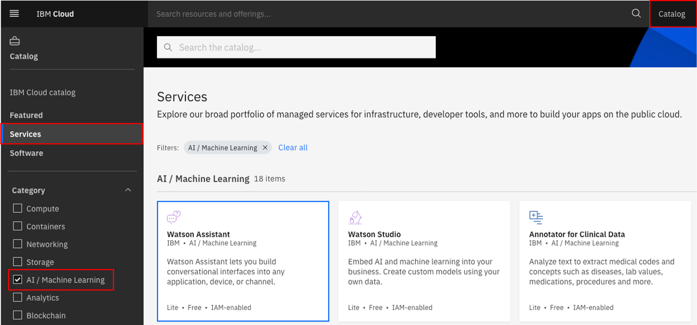

Afterwards launch your Watson Assistant Service, you will find it on your dashboard under services.

Go to skills and create a new skill, when asked choose the dialog skill. Select import skill and upload the `skill-create-Jira-Issues.json` file.

> If you can't find `skills`, click on the profile icon in the upper right corner, and click `Switch to classic experience`.

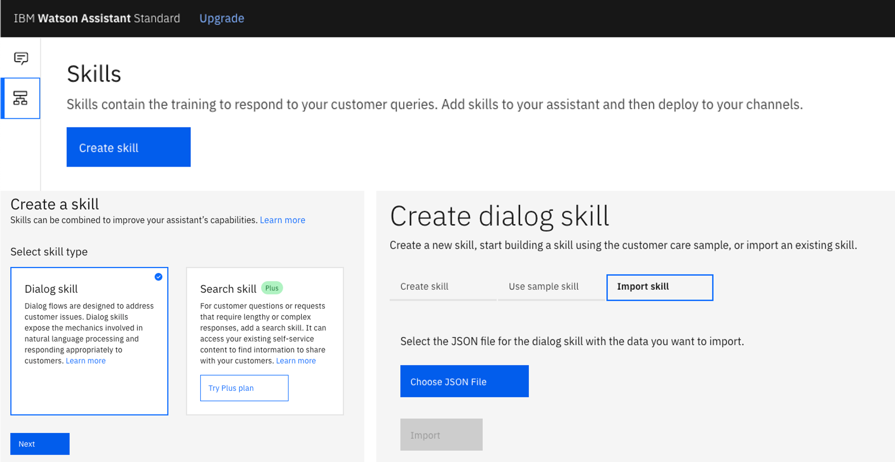

Click options and then select Webhooks. Provide the Web Action URL you obtained when creating the Endpoint. Make sure to add a `.json` at the end.

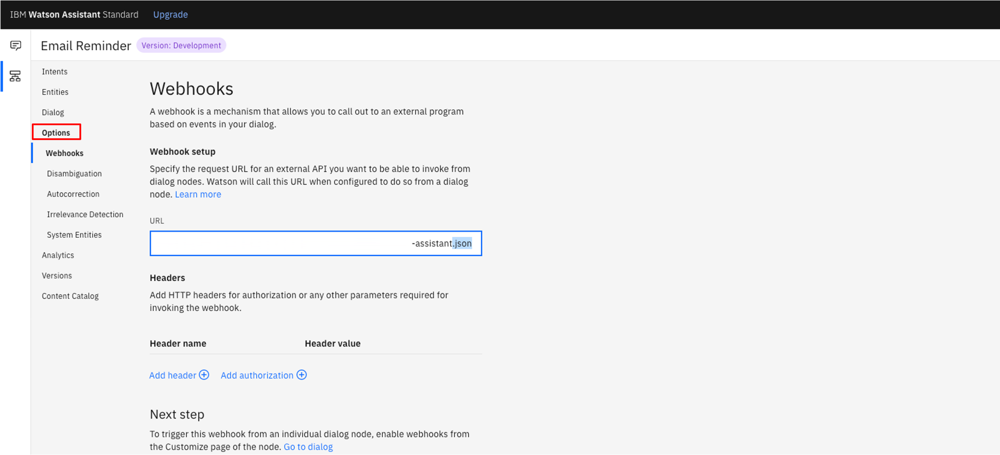

Now go to Entities -> My Entities and click on @jiraIssueType. In the table you can see which words are mapped to which issuetype ID. 

Right now it should look like this:


| Values  | Type  |
|---      |---    |
| 10001 | Story |
| 10002 | Task |
| 10003 | Bug |

The values collum shows the Issuetype ID, the Type colllum shows the Issue's name as well as its Synonyms. In order for Watson assistant to create the correct issue, you need to change the ID to the ones you wrote down earlier.

Now you can go to the dialog and try it out for yourself. You can create a new issue and verify it in your Jira project.

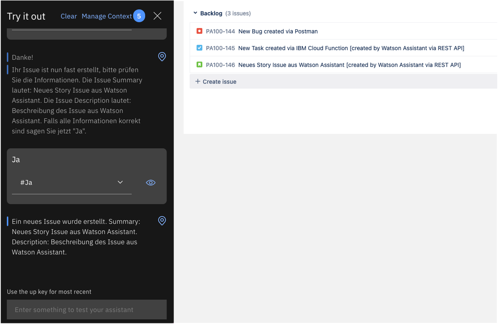


## If you have any questions just contact me
Felix Augenstein<br>
Digital Tech Ecosystem & Developer Representative @IBM<br>
Twitter: [@F_Augenstein](https://twitter.com/F_Augenstein)<br>
LinkedIn: [linkedin.com/in/felixaugenstein](https://www.linkedin.com/in/felixaugenstein/)
